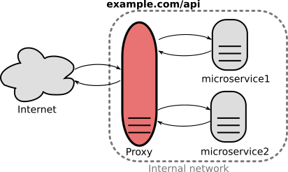

This project solves some usual API Gateway drawbacks. There are many way to implement an API Gateway at server-side: by software, as .., by apache or by Nginx. This project is an specialilized solution for Nginx, that use a reverse-proxy and implement it as an script. In this context the most usual drawbacks are:[1]

* It is yet another highly available component that must be developed, deployed, and managed. 
* a risk that the API Gateway becomes a development bottleneck &mdash; developers must update the API Gateway in order to expose each microservice’s endpoints... and developers will be forced to wait in line in order to update the gateway. 

References

1. [nginx.com/blog](https://www.nginx.com/blog/building-microservices-using-an-api-gateway/), "Building Microservices: Using an API Gateway".

2. [wikipedia.org](https://en.wikipedia.org/wiki/Composite_pattern), "Composite pattern".
